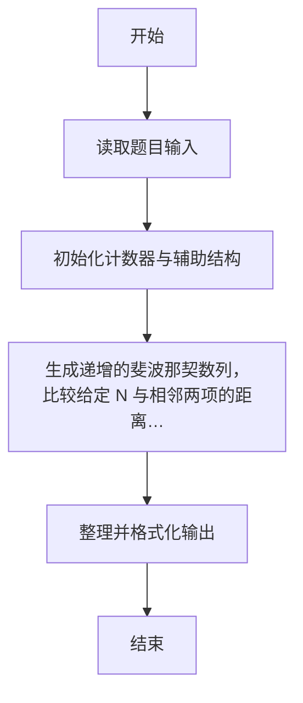
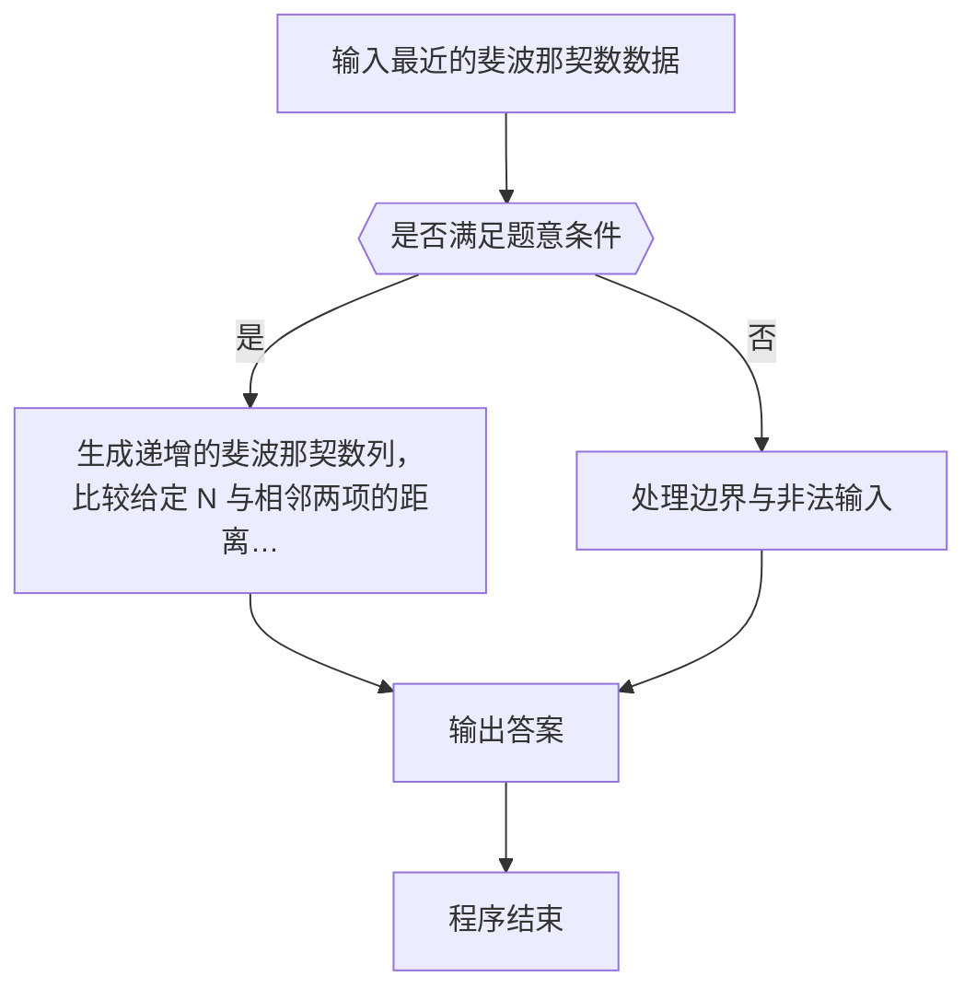

# 1124 最近的斐波那契数

- **分值：** 20分

### 题目描述

**斐波那契数列** F_n 的定义为：对 n ≥ 0 有 F_n+2 = F_n+1 + F_n，初始值为 F_0 = 0 和 F_1 = 1。所谓与给定的整数 N **最近的斐波那契数**是指与 N 的差之绝对值最小的斐波那契数。

本题就请你为任意给定的整数 N 找出与之最近的斐波那契数。

### 输入格式：

输入在一行中给出一个正整数 N（≤ 10^8）。

### 输出格式：

在一行输出与 N 最近的斐波那契数。如果解不唯一，输出最小的那个数。

### 输入样例：
```
305
```

### 输出样例：
```
233
```

### 样例解释

部分斐波那契数列为 { 0, 1, 1, 2, 3, 5, 8, 13, 21, 34, 55, 89, 144, 233, 377, 610, ... }。可见 233 和 377 到 305 的距离都是最小值 72，则应输出较小的那个解。
<br/>
**感谢 江月 指出的题面错误！已于 25.3.13 修改。**


### 解题思路

本题的核心是：生成递增的斐波那契数列，比较给定 N 与相邻两项的距离并选择较近者。程序先读取题目输入，再按照上述规则完成数据处理，最后严格按照题目要求输出结果。实现时应优先根据题目约束选择合适的数据类型和数据结构，避免溢出或不必要的重复计算。

时间复杂度为 O(log N)；空间复杂度取决于输入规模，主要用于保存题目数据和中间结果。

### 代码流程说明

1. 读取 1124 最近的斐波那契数 所需的输入数据。
2. 初始化计数器、数组或其他辅助变量。
3. 生成递增的斐波那契数列，比较给定 N 与相邻两项的距离并选择较近者。
4. 按题目规定的格式输出计算结果。

### 代码实现

```r
# 实现原理：本题的核心是：生成递增的斐波那契数列，比较给定 N 与相邻两项的距离并选择较近者。程序先读取题目输入，再按照上述规则完成数据处理，最后严格按照题目要求输出结果。实现时应优先根据题目约束选择合适的数据类型和数据结构，避免溢出或不必要的重复计算。 时间复杂度为 O(log N)；空间复杂度取决于输入规模，主要用于保存题目数据和中间结果。
# 代码按“读取输入—核心计算—格式化输出”的流程组织。

# 读取题目输入。
n<-scan(what=integer(),quiet=TRUE)[1]
a<-0
b<-1
# 按题意重复处理，直到满足结束条件。
while(b<n){
  tmp<-a
  a<-b
  b<-tmp+b
}
# 按题目要求输出结果。
cat(if(n-a<=b-n)a else b, '\n', sep='')

```

### 代码流程图



### 解题流程图



### 常见易错点

- 注意输入范围与边界值，选择合适的数据类型。
- 循环与下标要严格对应题目定义，避免越界或漏算。
- 输出格式必须与题目要求完全一致，包括空格与换行。
- 输出格式必须与题目要求完全一致，包括空格、换行、大小写和特殊符号。
